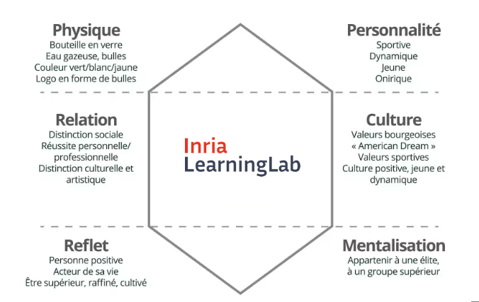

# Accueil

Barre de navigation horizontale :  

- Onglet "Productions Pédagogiques" après "Actualités" avec liste sous menu (Mooc, ePoc, jeux sérieux) ?  
- Onglet "Education scientifique" avant "Publications" avec liste sous menu (missions, activités, historique) ?  

Affichage de 3 blocs alignés horizontalement :

- Dernières actualités (lien vers toutes les actualités et RS)  
- Mise en avant des dernières productions de chaque type (lien vers chaque type de ressource)  
- Brève présentation du service (lien vers education scientifique - missions)  

Question, discussion et faisabilité:  

- Fichiers-Dossiers : Blog/Actualités ?  
- Associer un texte de présentation à chaque type de ressource-blog (Mooc, ePoc, jeu) : Qu’est ce qu’un MOOC/ePoc/jeu et pourquoi faire un Mooc/ePoc/Jeu ?  
- “call to action” visuel (par encadré par ex.) pour aspects pratiques de chaque fiche "ressource" :  

    - 🗓 Accès au MOOC/epoc/jeu  
    - Date de début : 17 juin 2024  
    - Plateforme : FUN MOOC  
    - 👉 S’inscrire au MOOC  

- Répartition graphique de la navigation comme par exemple pour la marque "Perrier":  

